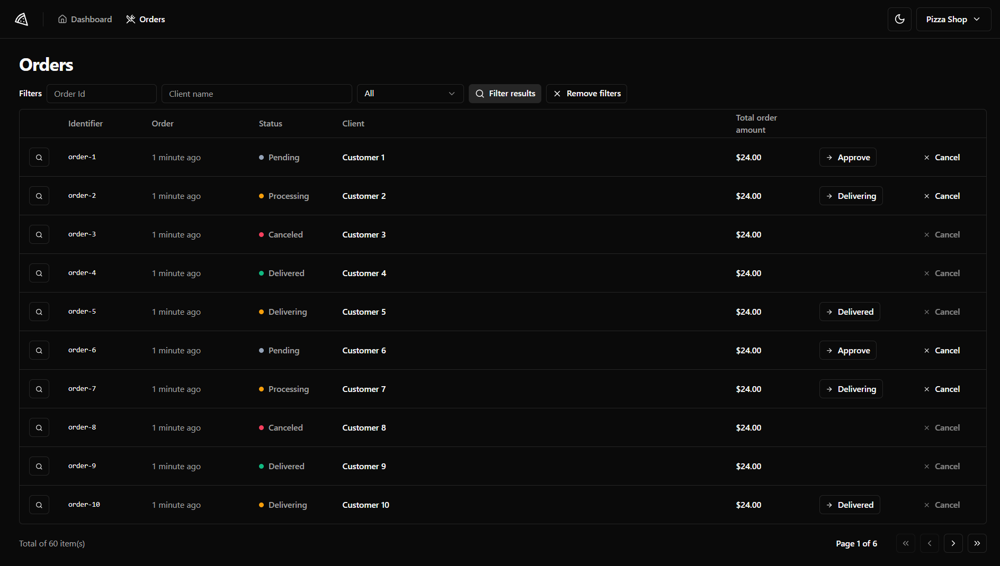

<h1 align="center">
    
</h1>

<p align="center">
  <a href="#-screenshots">Screenshots</a>&nbsp;&nbsp;&nbsp;|&nbsp;&nbsp;&nbsp;
  <a href="#-about">About</a>&nbsp;&nbsp;&nbsp;|&nbsp;&nbsp;&nbsp;
  <a href="#-project">Project</a>&nbsp;&nbsp;&nbsp;|&nbsp;&nbsp;&nbsp;
  <a href="#-technologies">Technologies</a>&nbsp;&nbsp;&nbsp;|&nbsp;&nbsp;&nbsp;
  <a href="#-how-to-run">How to run</a>
</p>

## 📷 Screenshots

### Dashboard
<p align="center">
  
</p>

### Orders
<p align="center">
  
</p>

### Order Details
<p align="center">
  
</p>

## 🍕 About

Pizza Shop is your ultimate solution for efficient restaurant management. From registering restaurants to tracking customer orders, Pizza Shop streamlines your operations, ensuring a smooth and hassle-free experience for both staff and managers.

## 🚀 Project

🌟 Situation:

Restaurants require a reliable system to manage daily operations, including user authentication and order tracking. The challenge was to develop an application that simplifies these processes with an easy-to-use interface.

🎯 Task:

Develop a restaurant management application that:

- Provides secure sign-in and sign-out functionality.
- Displays a comprehensive list of orders made by clients.
- Features a clean and intuitive design for ease of use.
- Ensures seamless performance and scalability.

🚀 Action:

To achieve these goals, I employed the following actions:

- Design & User Experience: Created a user-friendly interface using Tailwind CSS for custom styling, ensuring a consistent and appealing look.
- User Authentication: Implemented secure sign-in and sign-out functionality using React Hook Form for form management and Zod for schema validation, ensuring robust and secure authentication processes.
- State Management: Leveraged React Query to handle server state and data synchronization, ensuring real-time updates and consistent performance.
- Technology Stack: Chose React.js with Vite for fast development and optimal performance, and TypeScript for type safety and maintainable code.
- Mocking & Testing: Used Mock Service Worker to mock API requests during development, and Testing Library along with Playwright for comprehensive testing, ensuring reliability and smooth functionality of the application.

🏆Result:

Pizza Shop successfully delivered:

- Efficient Order Management: Staff could easily track and manage customer orders, improving overall efficiency and customer satisfaction.
- Secure Authentication: The secure sign-in and sign-out process ensured the safety and privacy of user data.
- Positive Feedback: The application was praised for its intuitive design and reliability, leading to increased user adoption and satisfaction.
- Scalable and Maintainable Codebase: The use of React.js with Vite and TypeScript ensured the app was easy to maintain and scalable for future enhancements.

## 🔧 Technologies

Throughout these projects, I have utilized a variety of technologies and tools, including:

- [React.js](https://react.dev/)
- [Vite](https://vitejs.dev/)
- [TypeScript](https://www.typescriptlang.org/)
- [Tailwind CSS](https://tailwindcss.com/)
- [React Query](https://tanstack.com/query/latest/docs/framework/react/overview)
- [Axios](https://axios-http.com/)
- [React Hook Form](https://www.react-hook-form.com/)
- [Zod](https://zod.dev/)
- [Mock Service Worker](https://mswjs.io/)
- [Testing Library](https://testing-library.com/docs/react-testing-library/intro/)
- [Playwright](https://playwright.dev/)

## 😊 How to run

Before starting, you need to have [Git](https://git-scm.com) and [Node](https://nodejs.org/en/) installed on your machine.

```sh
- Clone this repo:
$ git clone https://github.com/marcelopajr/pizza-shop-web

- Enter directory:
$ cd pizza-shop-web

- Install dependencies:
$ npm install

- Launch the app:
$ npm run dev:test

- To run tests with Playwright:
$ npx playwright test --ui

- If you are also running the pizza-shop-api (more details bellow):
$ npm run dev

- Use this email to login: marcelopereiradev@gmail.com and check your pizza-shop-api terminal
```

⚠️ If you want to run the application with more realistic data, clone this repository [pizza-shop-api](https://github.com/marcelopajr/pizza-shop-api) and follow the steps to run the API. Otherwise, the application will run with mocked data from the Mock Service Worker.

Have fun!
